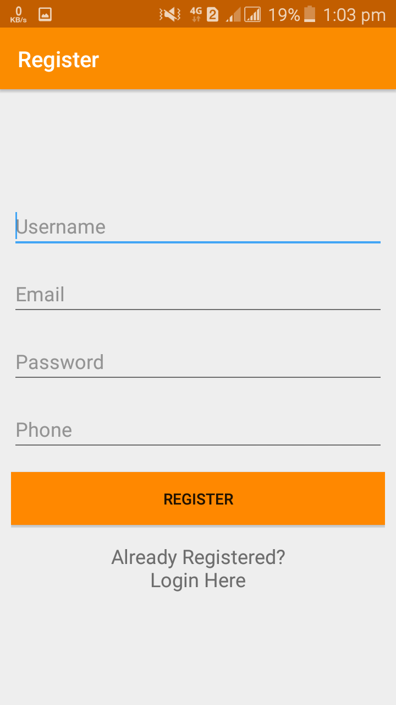
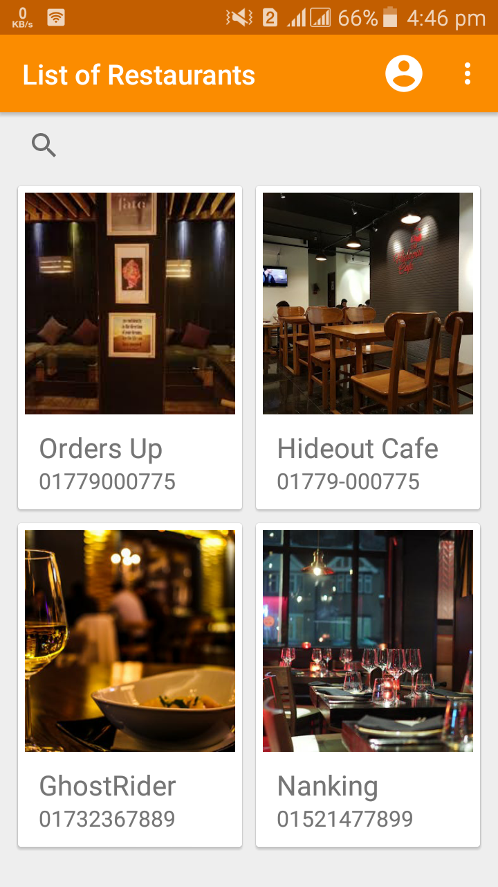
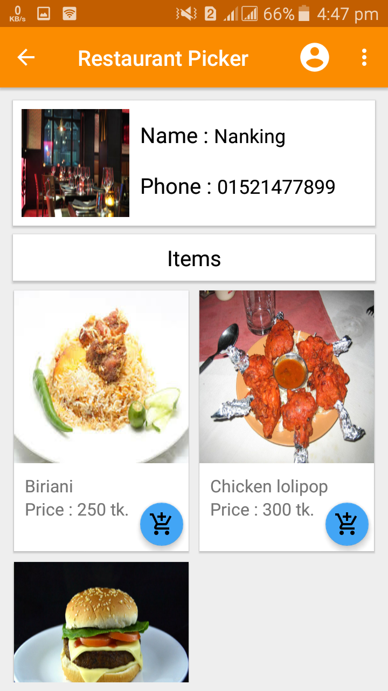
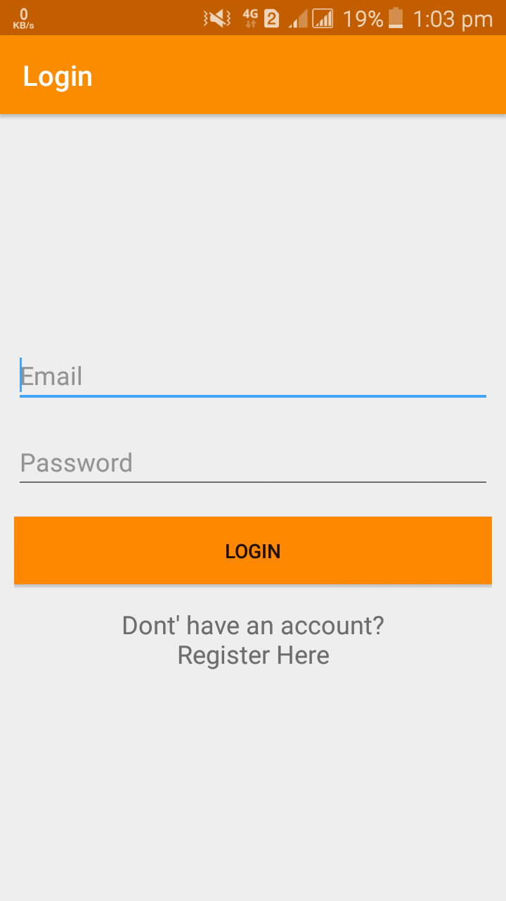

# Restaurant Picker
Restaurant picker is an android app that connects restaurant owners and their customers where restaurant owners publishes their food products via an web application and the customers can view the product with the Android app.

There are two parts of this project. This is the android part which will be used by the customers. Restaurant owners will use the web application to post their food and the items will be viewed in the Android app.

Link of the web project: https://github.com/shoukhin93/Restaurant-Picker-web-part

## Screenshots

